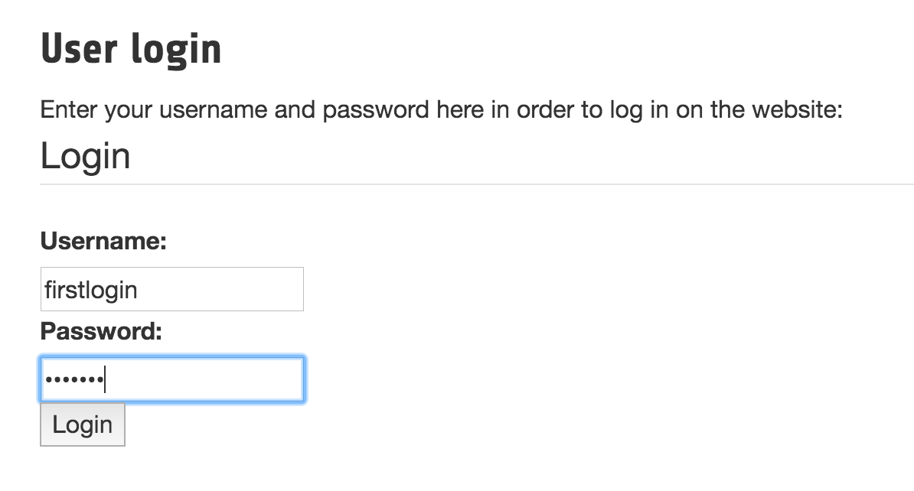
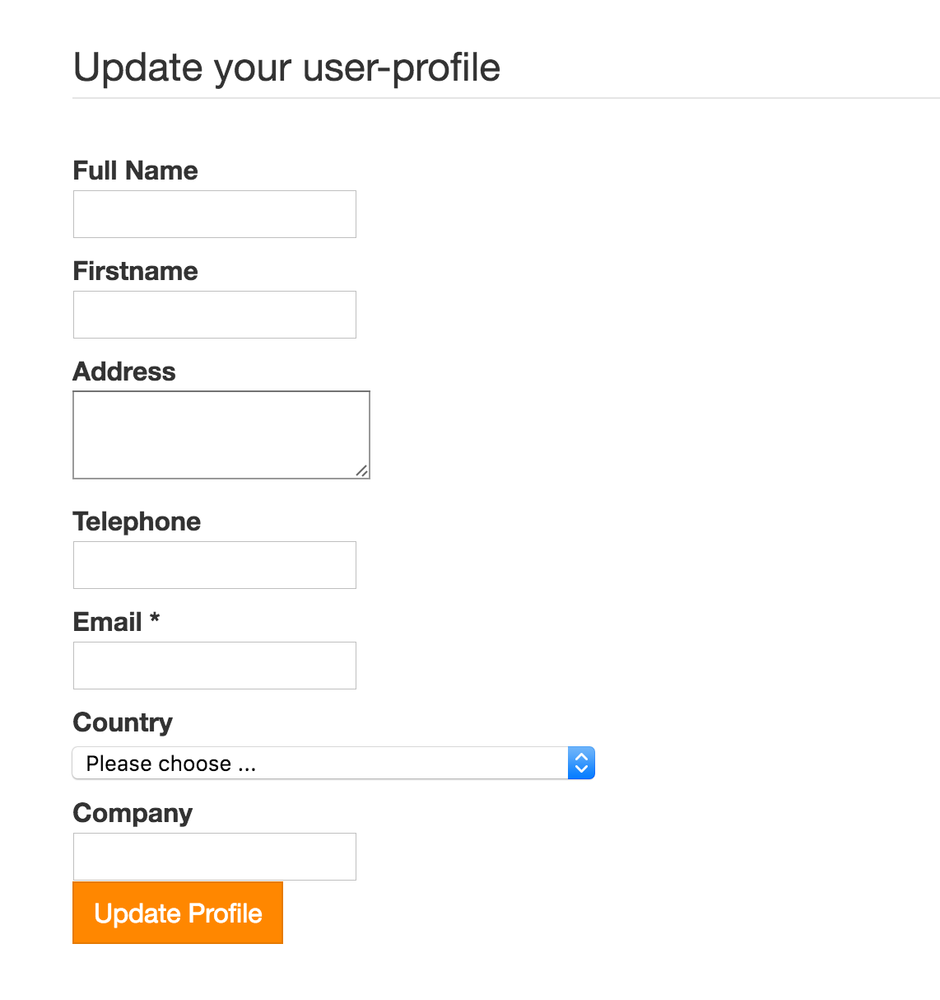

.. ==================================================
.. FOR YOUR INFORMATION
.. --------------------------------------------------
.. -*- coding: utf-8 -*- with BOM.

.. include:: ../Includes.txt

What does it do?
================

If you need user to update their user data, this extension will fit your needs. The extension adds a flag to the fe_users table, wich identifies, if the user updated his data.
If activated the extension checks at login if the new fe_users field "changed_data" is 0 (not updated user data) or 1 (already updated userdata). If is 0 the user will get redirected to a page where the user needs to update his data.
After the user saved the form and updates his data, he will be able to surf all protected pages.
If he doesn't he isn't able to call any protected page, there will always be a redirect to the update form instead of the protected page.
The users will still be able to visit not protected pages.

	Login form

	Update form showed after forced redirect
