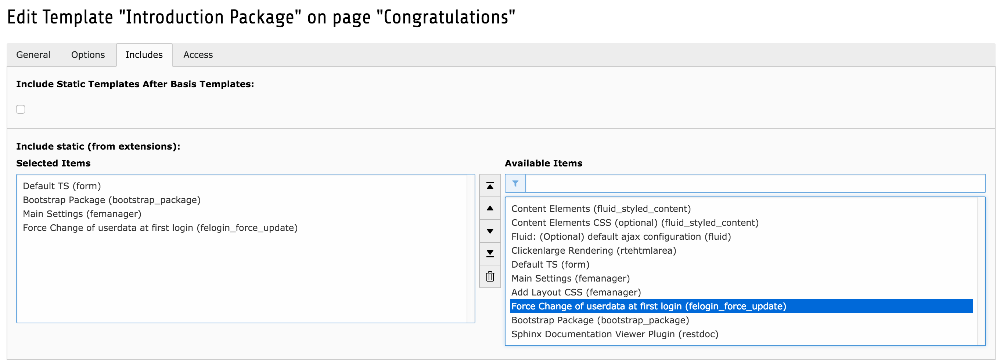

.. ==================================================
.. FOR YOUR INFORMATION
.. --------------------------------------------------
.. -*- coding: utf-8 -*- with BOM.

.. include:: ../Includes.txt

.. _admin-manual:

Administrator Manual
====================

Don't be afraid. Easy to setup, just follow the installation instructions.

Installation
------------

The extension is tested in TYPO3 6.2 and TYPO3 7.6.4
Be aware that the extension depends on fe_login and femanager extension wich must be installed.
There should also be a fe_login form integrated somewhere on your page.

- Install the extension via extension manager or clone from github.
- Then integrate the static TypoScript on the root page of your website

	Integrate static TypoScript

- Create a page and put femanger plugin on that newly created page

	femanger edit form settings, feel free wich data you need your users to update

- Now you need to get the id of that newly created page (hover over page icon in the page tree, the id appears after a few seconds). Knowing that information you can set up the constants.

Constants
------------
The following constants are available and required
::

	plugin.tx_feloginforceupdate{

		settings {
		forceDataChange = 1				// activate/deactivate the force
		firstLoginPid = 2				// this is the id of your previously created page (the one with the femanager edit form on it)
		fullUrlToEditPage =				// the full url to the page with the edit form http://www.urlToEditForm.com
		}

	}

.. note:: You need to set fullUrlToEditPage right now, if the firstLoginPid is e.g. 2 then your fullUrlToEditPage will be http//www.yourdomain.com/index.php?id=2 (or realUrl equivalent). This is needed as we are doing the redirect back to the edit page via config.additionalHeaders = Location As there is no stdWrap at the moment we need the full Url. We will work on this issue. If you have some suggestion get in contact or make a pull request on Github.

FAQ
^^^

No FAQ until now.
